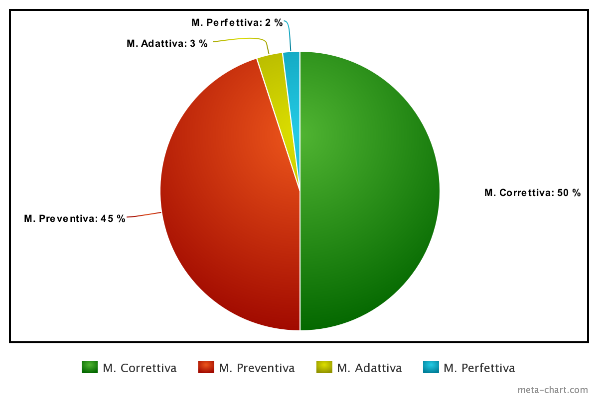

# Manutenzione
La manutenzione di un software è un processo importante per garantire che esso funzioni correttamente e soddisfi continuamente le esigenze dell'utente. Ci sono diversi tipi di manutenzione software: **correttiva** (rimozione di bug ecc.), **adattiva** (adattamento a cambiamenti dell'ambiente in cui opera il software), **perfettiva** (risposta a nuove richieste/requisiti dell'utente, miglioramenti prestazionali ecc.) e **preventiva** (miglioramento della manutenibilità futura).

Nel nostro caso il software non è stato sviluppato su commissione ma secondo il paradigma COTS (*Commercial Off The Shelf*), dunque la manutenzione perfettiva, qualora venisse effettuata, sarebbe dovuta a mutamenti del mercato e delle necessità implicite della community, invece che a un'esplicita richiesta del committente.

Come da definizione, anche nel nostro caso la fase di manutenzione è cominciata immediatamente dopo la consegna dell'applicativo e durerà per tutta la vita utile dello stesso. Si stima che questa fase richieda 20 ore al mese per ogni membro del team. Ad oggi si è trattato principalmente di manutenzione correttiva e preventiva: essendo il sistema in funzione da poco tempo non ci sono ancora state veri e propri cambiamenti dell'ambiente o delle richieste di mercato ma non ci precludiamo la possibilità che in futuro al nostro programma possa essere chiesto di più.

Il team dedica parte del suo tempo sia all'utilizzo dell'applicativo per cercare bug o funzionalità non correttamente implementate, sia all'analisi del codice alla ricerca di bad smells. In particolare il team ritiene prioritaria l'*eliminazione* dei seguenti sopra a tutti gli altri:
- utilizzo improprio della gerarchia delle classi
- assenza di commenti
- indentazione scorretta, in presenza della quale il codice JSX diventa illeggibile

Per garantire la manutenzione efficiente e di qualità, è importante seguire una serie di best practice. Nel nostro caso sono state:
- Documentazione: mantenere una documentazione dettagliata del software, inclusi i requisiti, il design e il codice sorgente.
- Monitoraggio: utilizzare strumenti di monitoraggio per identificare eventuali problemi e per prevenire il verificarsi di problemi in futuro.
- Aggiornamenti: applicare regolarmente gli aggiornamenti di sicurezza e correggere eventuali problemi di sicurezza.
- Test: effettuare regolarmente test del software per verificare che funzioni correttamente e che soddisfi le esigenze degli utenti.

