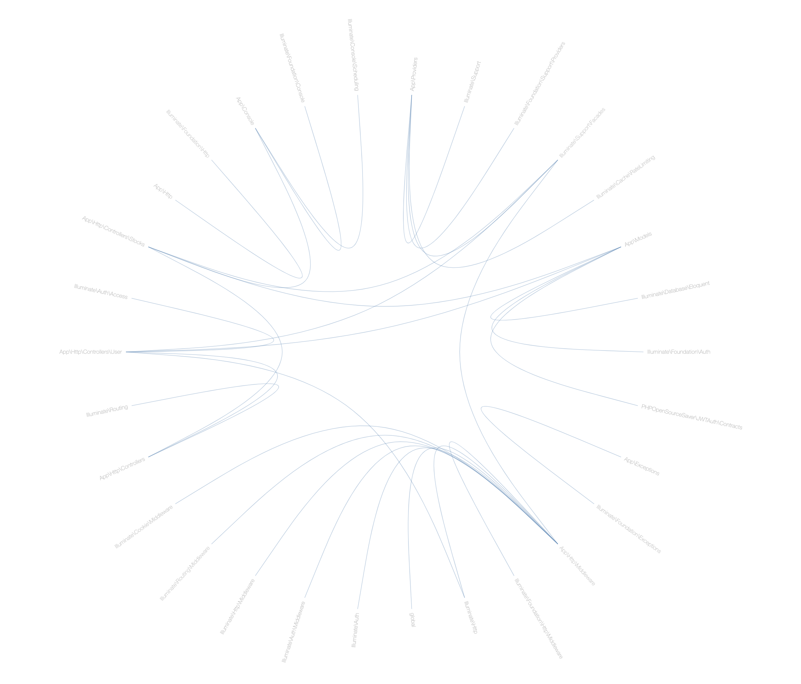
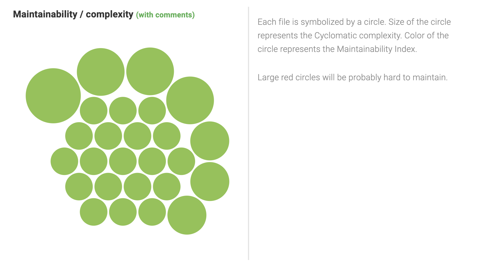
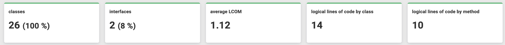

# Software Design @andrearoota

Il progetto funziona su uno stack composto da [Apache](https://httpd.apache.org/) - [Laravel](https://laravel.com/) - [PostgreSQL](https://www.postgresql.org/) - [React](https://reactjs.org/) secondo il paradigma [MVC](https://en.wikipedia.org/wiki/Model%E2%80%93view%E2%80%93controller).

La gestione dei dati, delle api e della logica è gestita dal cosiddetto backend, composto da Apache, Laravel e PostgreSQL dockerizzati attraverso un tool ([Laravel Sail](https://laravel.com/docs/9.x/sail)) fortnitoci da Laravel.

La parte di visualizzazione dei dati e interazione con l'utente viene gestita dal framework React che lavora appoggiandosi agli endpoint forniti dal backend ([documentazione api](../API/)).

## PhpMetrics
Per effettuare diversi calcoli di complessità e misurazioni del codice abbiamo optato per utilizzare lo strumento di misurazione [PhpMetrics](https://www.phpmetrics.org/).

I risultati di tali misurazioni e calcoli si trovano nella sotto directory `Report`, per una completa visualizzazione consigliamo la consultazione dell'intero report; di seguito riportiamo invece alcuni grafici esplicativi delle varie misurazioni.

### Coupling

### Manutenibilità

### Metriche OOP

## Design pattern
All'interno del framework Laravel sono presenti molteplici design pattern:
- Builder pattern
- Factory pattern
- Strategy pattern
- Provider pattern
- Repository pattern
- Facade pattern

Quelli da noi maggiormente sfruttati sono Factory, per la parte di generazione dei dati, e Facade, per la parte di autenticazione.
