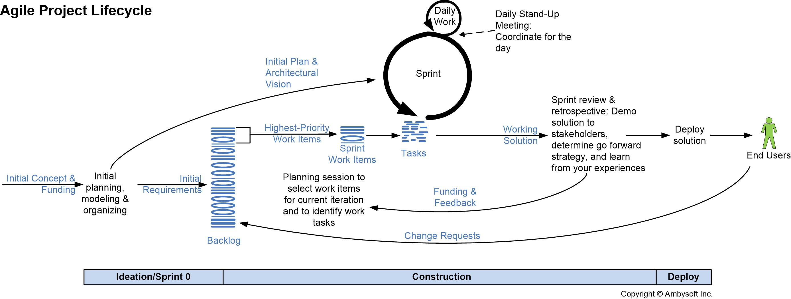

# Software Life Cycle @pierGit7

**Per il processo di sviluppo il team ha scelto un approccio di tipo Agile, per avere una risposta più rapida ai cambiameti e per non essere legati ad un  piano da seguire.**

## SCRUM LIFE CYCLE
Per lo sviluppo del software abbiamo seguito lo **SCRUM** life cycle. Inizialmente, dopo aver definito tutti i requisiti del progetto, abbiamo redatto un **product backlog** con tutte le funzionalità da implementare. Per ogni **sprint** poi abbiamo selezionato alcune di queste (in ordine di priorità) in uno sprint backlog e ci siamo concentrati sull' implementazione e il test di queste. Il team si aggiornava ogni giorno nel **Daily Scrum** e in base alle necessità, ci siamo incontrati per gli **Sprint meetings**. Alla fine di ogni sprint, di circa 4 settimane, il team si è ritrovato per la scrittura dello **sprint review**.

## Aglile principles
le linee guida del metodo agile che hanno guidato lo sviluppo del nostro progetto sono:
- Il **team** e i suoi membri sono molto importanti, bisogna preservare armonia e coordinazione. Ognuno ha delle conoscienze che mette al servizio del team al fine di risolvere problemi reali.
- Ci concentriamo maggiormente sull' implementazione delle funzionalità sprint e sulla **programmazione piuttosto che sulla documentazione**. Alla fine di ogni sprint tutte le nuove funzionalità sono funzionanti e possono essere implementate.
- Il team si adatta ai **cambiamenti** in modo flessibile. Se il **cliente** avanzasse delle richieste in fase di implementazione o comunque dopo l’avvenuta stesura dei requisiti, cercheremo di fare in modo di accontentarlo stando in ogni modo attenti a quello che si è sviluppato fino a quel momento.

## MECCANISMO DI SINCRONIZZAZIONE DI MITZBERG'S 
- Anche se la divisione dei compiti è netta, non c'è forte specializzazione. Se c'è un problema si cerca di risolverlo insieme, indipendentemente che sia backend/frontend.

## ORGANIZZAZIONE DEL TEAM
- Lo scrum master cambia per ogni sprint. Chiunque svolga il ruolo di scrum master deve comportarsi come un "coach", deve aiutare e motivare il team.
- Utilizziamo la tecnica del pair programming: per lo sviluppo dei lati frontend e backend, gli sviluppatori hanno l’opportunità di lavorare in coppia: uno dei due scrive il codice mentre l’altro funge da supervisore e revisore; i due possono cambiarsi di ruolo.
